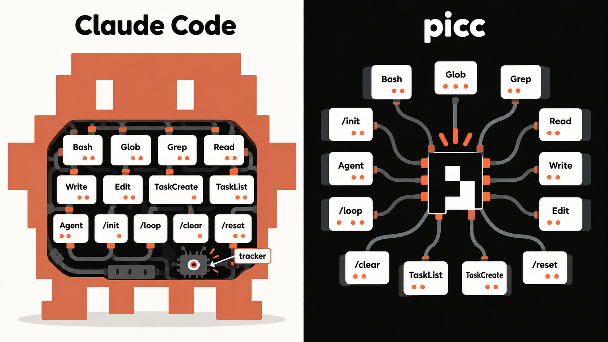

<div align="center">

# picc

[[English]](README.md) [[中文]](README_zh.md)

> **一个无追踪器的 Claude Code 即插即用替代品**

**从这里开始打造属于你自己的 harness**


</div>

一套构建在 [pi coding agent](https://pi.dev) 之上的开源插件。

如果你用过 [Claude Code](https://www.anthropic.com/claude-code) 并希望切换到完全开源的技术栈，picc 将 Claude Code 的 harness 移植到了 pi 中，让你开箱即用：相同的工具、相同的命令、相同的权限模式、相同的 UI 细节。

此外，它也是构建属于自己的 harness 的良好起点（基于 pi agent）。
所有人都知道 Claude Code 拥有（几乎）最好的 harness，但在此之前没有任何一套现有插件能忠实地复刻它的 harness。

> 免责声明：代码由 vibe coding 得到，但作者基于可靠的参考资料，复现了 Claude Code 的功能。作者在调试过程中使用 [Tresor](https://github.com/Ladbaby/Tresor) 来监视 pi 的流量，以确保各扩展按预期工作。

## 为什么用 picc 而不是 Claude Code？

- Claude Code：一个**臃肿**的 agent，什么都在里面，包括**追踪器**。大部分**不可定制**。
- picc (pi)：一个**轻量**的 agent 核心，可以编写并使用**任意自定义扩展**，包括复刻 Claude Code harness 的那些扩展。



||Claude Code|picc (pi)|
|---|---|---|
|是否开源？|❌（内置隐私追踪器）|✅|
|可定制？|⚠️部分（通过 Claude Mods）|✅（完全）|
|使用第三方大模型？|⚠️部分（可能需要额外软件做 API 转换）|✅|
|Claude Code 生态|✅|⚠️部分（可以伪装成 Claude Code CLI）|
|Pi 生态|❌|✅|

## 你会得到什么

### Claude Code CLI 的即插即用替代品

[](https://www.npmjs.com/package/@ladbabynpm/picc-claude-shim) [picc-claude-shim](https://github.com/Ladbaby/picc-claude-shim) 将 pi agent 伪装成 Claude Code CLI，因此 pi 可以无缝地接入社区为 Claude Code 打造的软件，例如 [hapi](https://github.com/tiann/hapi) 和 [T3 Code](https://github.com/pingdotgg/t3code)。

### Claude Code 的核心能力

| 扩展 | 功能 |下载量|
|---|---|---|
| [picc-permission-modes](https://github.com/Ladbaby/picc-permission-modes) | 将 Claude Code 的权限系统移植到 pi：`default`、`acceptEdits`、`plan`、`bypass` 和 `auto` 模式，外加用户自定义的权限规则。 |[](https://www.npmjs.com/package/@ladbabynpm/picc-permission-modes)|
| [picc-memory](https://github.com/Ladbaby/picc-memory) | 持久化的、基于文件的记忆系统，可跨对话保留 |[](https://www.npmjs.com/package/@ladbabynpm/picc-memory)|
| [picc-subagents](https://github.com/Ladbaby/picc-subagents) | `Agent` 工具——支持前台/后台运行、自定义 agent 类型、实时 widget 以及 FleetView 的子代理 |[](https://www.npmjs.com/package/@ladbabynpm/picc-subagents)|

### 工具

| 扩展 | 功能 |下载量|
|---|---|---|
| [picc-tasks](https://github.com/Ladbaby/picc-tasks) | Claude Code 风格的任务跟踪：`TaskCreate`、`TaskGet`、`TaskList`、`TaskUpdate` |[](https://www.npmjs.com/package/@ladbabynpm/picc-tasks)|
| [picc-bash](https://github.com/Ladbaby/picc-bash) | Claude Code 风格的 `Bash` 工具，支持后台命令，外加 `TaskStop`（覆盖 pi 内置的 `bash`） |[](https://www.npmjs.com/package/@ladbabynpm/picc-bash)|
| [picc-glob](https://github.com/Ladbaby/picc-glob) | Claude Code 风格的 `Glob` 文件查找器，基于 ripgrep 实现 |[](https://www.npmjs.com/package/@ladbabynpm/picc-glob)|
| [picc-grep](https://github.com/Ladbaby/picc-grep) | Claude Code 风格的 `Grep` 内容搜索，基于 ripgrep 实现（覆盖 pi 内置的 `grep`） |[](https://www.npmjs.com/package/@ladbabynpm/picc-grep)|
| [picc-read](https://github.com/Ladbaby/picc-read) | Claude Code 风格的 `Read` 工具（覆盖 pi 内置的 `read`） |[](https://www.npmjs.com/package/@ladbabynpm/picc-read)|
| [picc-write](https://github.com/Ladbaby/picc-write) | Claude Code 风格的 `Write` 工具（覆盖 pi 内置的 `write`） |[](https://www.npmjs.com/package/@ladbabynpm/picc-write)|
| [picc-edit](https://github.com/Ladbaby/picc-edit) | Claude Code 风格的 `Edit` 工具（覆盖 pi 内置的 `edit`） |[](https://www.npmjs.com/package/@ladbabynpm/picc-edit)|
| [picc-ask-user-question](https://github.com/Ladbaby/picc-ask-user-question) | `AskUserQuestion` 工具——任务执行过程中提出结构化的多选题 |[](https://www.npmjs.com/package/@ladbabynpm/picc-ask-user-question)|

### 命令

<!-- | [picc-goal](https://github.com/Ladbaby/picc-goal) | Long-running `/goal` supervisor for multi-step work | -->
| 扩展 | 功能 |下载量|
|---|---|---|
| [picc-command-alias](https://github.com/Ladbaby/picc-command-alias) | Claude 风格的命令别名：`/exit`、`/clear`、`/reset` 映射到 pi 的内置行为 |[](https://www.npmjs.com/package/@ladbabynpm/picc-command-alias)|
| [picc-loop](https://github.com/Ladbaby/picc-loop) | `/loop`——Claude Code 风格的 cron 调度，用于周期性或一次性任务 |[](https://www.npmjs.com/package/@ladbabynpm/picc-loop)|
| [picc-init](https://github.com/Ladbaby/picc-init) | `/init`——为 agent 生成项目上下文文件 |[](https://www.npmjs.com/package/@ladbabynpm/picc-init)|

### 锦上添花的小功能

| 扩展 | 功能 |下载量|
|---|---|---|
| [picc-recap](https://github.com/Ladbaby/picc-recap) | 离开摘要——你离开后发生的事情的回溯 |[](https://www.npmjs.com/package/@ladbabynpm/picc-recap)|
| [picc-working-spinner](https://github.com/Ladbaby/picc-working-spinner) | Claude Code 风格的工作指示器：转圈符号、闪烁效果、感知模式的状态栏、token 计数器 |[](https://www.npmjs.com/package/@ladbabynpm/picc-working-spinner)|

## 安装

前置条件：按照 [安装指南](https://pi.dev/docs/latest/quickstart) 安装 pi coding agent（picc 的核心）。

安装 pi 之后，你可以一行命令安装所有 picc 扩展：

**基于 Unix 的系统（Linux/macOS）：**

```bash
curl -fsSL https://raw.githubusercontent.com/Ladbaby/picc/main/install.sh | bash
```

**Windows（PowerShell）：**

```powershell
iwr https://raw.githubusercontent.com/Ladbaby/picc/main/install.ps1 -UseBasicParsing | iex
```

---

或者，手动执行以下命令：

```bash
pi install npm:@ladbabynpm/picc-claude-shim
pi install npm:@ladbabynpm/picc-permission-modes
pi install npm:@ladbabynpm/picc-memory
pi install npm:@ladbabynpm/picc-subagents
pi install npm:@ladbabynpm/picc-tasks
pi install npm:@ladbabynpm/picc-bash
pi install npm:@ladbabynpm/picc-glob
pi install npm:@ladbabynpm/picc-grep
pi install npm:@ladbabynpm/picc-read
pi install npm:@ladbabynpm/picc-write
pi install npm:@ladbabynpm/picc-edit
pi install npm:@ladbabynpm/picc-ask-user-question
pi install npm:@ladbabynpm/picc-command-alias
pi install npm:@ladbabynpm/picc-loop
pi install npm:@ladbabynpm/picc-init
pi install npm:@ladbabynpm/picc-recap
pi install npm:@ladbabynpm/picc-working-spinner
```

可以只安装其中任意子集——每个扩展都是独立的。

## 打造你自己的 Agent

picc 可以是你定制 Agent 的起点，但肯定不会是终点：

- **更换模型**——参考 [Pi 的文档](https://pi.dev/docs/latest/models)，或参考我们提供的 [~/.pi/agent/models.json](models.json) 和 [~/.pi/agent/settings.json](settings.json) 样例.
- **权限规则**——在 [picc-permission-modes](https://github.com/Ladbaby/picc-permission-modes) 的配置中按工具、按模式串（pattern）配置规则。
- **自定义**——每个扩展都是一个小巧、可读的 TypeScript 文件。fork 它、调整它、用 `pi install` 安装你自己的版本。

## 相关链接

- [pi 文档](https://pi.dev)
- [pi 源码](https://github.com/earendil-works/pi)
- [npm: @ladbabynpm](https://www.npmjs.com/~ladbabynpm)——所有 picc 包
